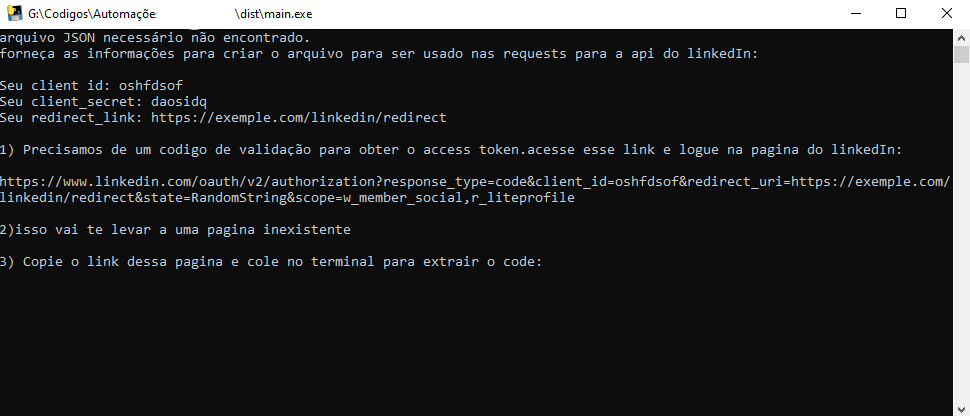
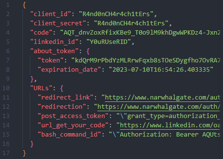
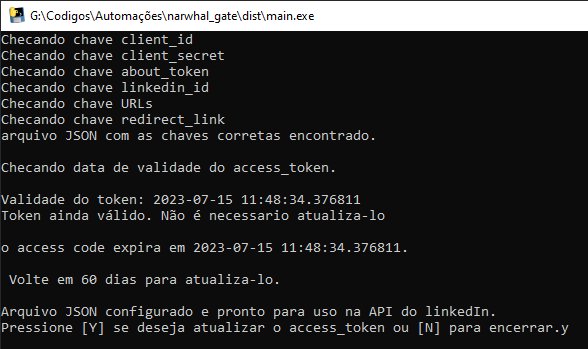

# easy-linkedinAPI-token
uma maneira simples e rápida de pegar o access code para usar a API do linkedIn.

Você pode clonar este repositório e rodar o arquivo main ou simplesmente baixar o main.exe e executá-lo. Em ambas as formas, a interação será feita inteiramente pelo terminal, mas clonando o repositório, você precisará ter ou instalar as libs necessárias:

- response
- datetime
- json
- subprocess

# Uso
Para usar o script, você precisa do seu Client ID e Client Secret, encontrados na página https://www.linkedin.com/developers/apps/210037222/auth, depois de já ter iniciado a criação do seu app no LinkedIn Developers. Você também precisará do link de redirecionamento configurado na mesma página, no campo OAuth 2.0 settings (onde também é possível verificar o token depois de requisitado).

Após inserir as informações, o terminal retornará um link concatenando o Client ID, Secret e o link de redirecionamento. Ao segui-lo, você cairá em uma página de autenticação. Fazendo o login, ela retornará uma página inexistente com um código de autenticação no meio da URL.

Basta colar a nova URL no terminal, e ele extrairá o código para você.

A partir daí, todo o resto é feito pelo script. Ele executa uma série de requisições pelo bash, concatenando da maneira correta as informações que você passou.

E, por fim, ele retorna um lindo JSON com tudo que você forneceu e que o script capturou para usar da maneira que achar melhor.

# Validade do token

O access token tem duração de 2 meses, então dentro de 60 dias você terá que solicitá-lo novamente. Com as informações contidas no arquivo JSON, basta fazer o processo de login na página de solicitação do código de verificação e colá-lo no script. Pronto, um token novinho para você por mais 2 meses.

# Limitações
Este script é projetado para capturar o access_token do LinkedIn. No entanto, ele não permite realizar outras operações além da obtenção do access_token. Certifique-se de usá-lo apenas para fins legítimos e de acordo com as políticas do LinkedIn.
